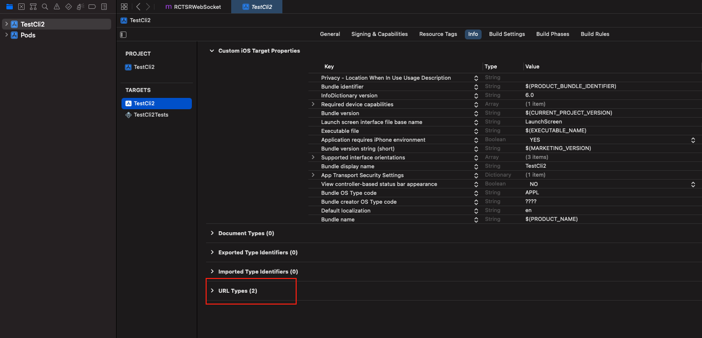
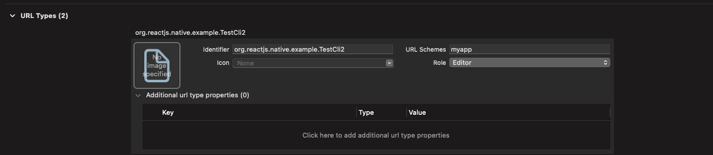

[//]: # @param group $$ React Native
[//]: # @param title $$ Deprecado WebView a Custom Tabs - Final
[//]: # @param author $$ Iván D. Sánchez

# Implementación Custom tabs y Safari View Controller en React Native

## Expo Go

### Especificaciones técnicas POC

- Node 14.17.0
- expo ~48.0.15
- expo-web-browser ^12.1.1
- react 18.2.0
- react-dom 18.2.0
- react-native 0.71.8

### expo-web-browser

Esta dependencia provee el acceso al navegador, en este caso Custom tabs para Android y Safari View Controller para iOS. También realiza el manejo del redireccionamiento.

#### Instalación

Instalación de expo-web-browser

```
yarn add expo-web-browser
```

#### Implementación

Implementación de expo-web-browser

```
import { StatusBar } from "expo-status-bar";
import { StyleSheet, Button, View } from "react-native";
import { openBrowserAsync } from "expo-web-browser";

export default function ExpoWebBrowserExample(url) {
  return (
    <View style={styles.container}>
      <Button
        title="Open Browser"
        onPress={() => openBrowserAsync('https://url-to-open.com')} />
      <StatusBar style="auto" />
    </View>
  );
}

const styles = StyleSheet.create({
  container: {
    flex: 1,
    backgroundColor: "#fff",
    alignItems: "center",
    justifyContent: "center",
  },
});
```

### Deep links

#### Android

Agregue la siguiente configuración a su archivo **app.json** ubicado en la raíz de su proyecto:

```
{
  "expo": {
    "android": {
      "intentFilters": [
        {
          "action": "VIEW",
          "data": [
            {
              "scheme": "myapp",
              "host": "checkout",
              "pathPrefix": "/congrats"
            }
          ],
          "category": ["BROWSABLE", "DEFAULT"]
        }
      ]
    }
  }
}

```

- En este caso el deep link se genera como **myapp://checkout/congrats**
- **pathPrefix** es una propiedad opcional

En caso que el proyecto todavía no tenga un **prebuild**, se puede testear el deep link usando expo go desde la terminal de la siguiente forma:

```
// url local del dispositivo de test
npx uri-scheme open exp://192.168.0.7:19000/--/checkout/congrats --android

// Nota: No es requerido pasar el scheme en estas pruebas
```

En caso de correr un **prebuild** de la aplicación, debemos verificar que el deep link para Android se haya configurado en el archivo:

```
android/app/src/main/AndroidManifest.xml
```

El deep link debe estar entre las etiquetas activity

```
    <activity  ....>
      ....
      <intent-filter data-generated="true">
        <action android:name="android.intent.action.VIEW"/>
        <data android:scheme="myapp" android:host="checkout" android:pathPrefix="/congrats"/>
        <category android:name="android.intent.category.BROWSABLE"/>
        <category android:name="android.intent.category.DEFAULT"/>
      </intent-filter>
      ....
    </activity>
```

#### iOS

Verifique que su archivo **app.json** contiene el nombre del scheme

```
"expo": {
  "scheme": "myapp"
}

```

Al ejecutar **npx expo prebuild** su archivo **ios/appname/Info.plist** debería contener algo similar al siguiente código

```
    <key>CFBundleURLTypes</key>
    <array>
      <dict>
        <key>CFBundleURLSchemes</key>
        <array>
          <string>myapp</string>
          <string>com.test.TestExpoBrowser</string>
        </array>
      </dict>
    </array>
```

#### Mas información

- [Expo WebBrowser](https://docs.expo.dev/versions/latest/sdk/webbrowser/)
- [Expo Deep links](https://docs.expo.dev/guides/deep-linking/)

## React Native CLI

### Especificaciones técnicas POC

- Node 14.17.0
- react 18.2.0
- react-native 0.71.8
- react-native-inappbrowser-reborn 3.7.0

### react-native-inappbrowser-reborn

#### Instalación

Instalación de react-native-inappbrowser-reborn

```
// Usando npm
npm install react-native-inappbrowser-reborn --save

// Usando yarn
yarn add react-native-inappbrowser-reborn
```

**Para las versiones de React Native >0.60**

- No es necasario importar y configurar manualmente las dependencia en el código nativo ya que este se hace automáticamente.

- Para la plataforma de iOS es necesario hacer este paso extra.

```
cd ios && pod install && cd ..
```

Verifique la configuración de su archivo **android/build.gradle**

Si utiliza Android support su archivo debería tener estas propiedades, en caso de faltar alguna agregarla. Las versiones pueden ser iguales o superiores.

```
buildscript {
  ext {
    buildToolsVersion = "28.0.3"
    minSdkVersion = 16
    compileSdkVersion = 28
    targetSdkVersion = 28
    // Only using Android Support libraries
    supportLibVersion = "28.0.0"
  }
```

Si utiliza AndroidX su archivo debería tener estas propiedades, en caso de faltar alguna agregarla. Las versiones pueden ser iguales o superiores.

```
buildscript {
  ext {
    buildToolsVersion = "30.0.2"
    minSdkVersion = 21
    compileSdkVersion = 30
    targetSdkVersion = 30
    ndkVersion = "21.4.7075529"
    // Remove 'supportLibVersion' property and put specific versions for AndroidX libraries
    androidXAnnotation = "1.2.0"
    androidXBrowser = "1.3.0"
    // Put here other AndroidX dependencies
  }
```

#### Implementación

Implementación de react-native-inappbrowser-reborn

```
import {Button, Linking} from 'react-native';
import InAppBrowser from 'react-native-inappbrowser-reborn';

const ButtonCustomTabs = () => {
  const openUrl = async (url) => {
    if (await InAppBrowser.isAvailable()) {
      InAppBrowser.open(url, {
        // iOS Properties
        dismissButtonStyle: 'cancel',
        preferredBarTintColor: '#453AA4',
        preferredControlTintColor: 'white',
        readerMode: false,
        animated: true,
        modalEnabled: true,
        // Android Properties
        showTitle: true,
        toolbarColor: '#6200EE',
        secondaryToolbarColor: 'black',
        enableUrlBarHiding: true,
        enableDefaultShare: true,
        forceCloseOnRedirection: false,
        // Animation
        animations: {
          startEnter: 'slide_in_right',
          startExit: 'slide_out_left',
          endEnter: 'slide_in_left',
          endExit: 'slide_out_right',
        },
      });
    } else {
      Linking.openURL(url);
    }
  };
  return (
    <Button
      title="Press Me"
      onPress={() =>
        openUrl('https://url-to-open.com')
      }
    />
  );
};

export default ButtonCustomTabs;

```

### Deep links

#### Android

Agregue el deep link en el archivo **android/app/src/main/AndroidManifest.xml** entre las etiquetas **activity**

```
<activity  ....>
  ....
  <intent-filter data-generated="true">
    <action android:name="android.intent.action.VIEW"/>
    <data android:scheme="myapp" android:host="checkout" android:pathPrefix="/congrats"/>
    <category android:name="android.intent.category.BROWSABLE"/>
    <category android:name="android.intent.category.DEFAULT"/>
  </intent-filter>
  ....
</activity>
```

#### iOS

Desde Xcode ubiquese en la información de su proyecto y agregue una nueva URL Types



Ingrese el **identifier** de su aplicación y la **URL Schemes** del deep link.



Esto genera el siguiente código en el archivo **ios/appname/Info.plist**

```
	<key>CFBundleURLTypes</key>
	<array>
		<dict>
			<key>CFBundleTypeRole</key>
			<string>Editor</string>
			<key>CFBundleURLName</key>
			<string>org.reactjs.native.example.TestCli2</string>
			<key>CFBundleURLSchemes</key>
			<array>
				<string>myapp</string>
			</array>
		</dict>
		<dict/>
	</array>
```

Agregue el siguiente código al archivo **ios/appname/AppDelegate.mm**

```
// iOS 9.x or newer
#import <React/RCTLinkingManager.h>

- (BOOL)application:(UIApplication *)application
   openURL:(NSURL *)url
   options:(NSDictionary<UIApplicationOpenURLOptionsKey,id> *)options
{
  return [RCTLinkingManager application:application openURL:url options:options];
}
```

#### Mas información

- [npm - react-native-inappbrowser-reborn](https://www.npmjs.com/package/react-native-inappbrowser-reborn)
- [GitHub - InAppBrowser for React Native](https://github.com/proyecto26/react-native-inappbrowser)
- [React Native - Linking](https://reactnative.dev/docs/linking)

### Volver a la App

En el caso de **Android** tanto con **expo-web-browser** como con **react-native-inappbrowser** el cierre del custom tab se hace de manera automática al momento de redireccionar a un deep link valido, en que caso que el link no sea valido no se ejecutará ninguna acción de redireccionamiento desde el custom tab.

En el caso de **iOS** es necesario cerrar la Safari View Controller de manera manual, para esto vamos a escuchar el evento de cuando cambie la url desde el componente que abre la ventana o el punto de entrada de la aplicación, y según la tecnología de implementación vamos a llamar el método para cerrar la Safari View Controller.

#### expo-web-browser

```
import { StatusBar } from "expo-status-bar";
import { StyleSheet, Button, View, Linking } from "react-native";
import { openBrowserAsync } from "expo-web-browser";
import * as WebBrowser from "expo-web-browser";
import { useEffect } from "react";

export default function App() {
  useEffect(() => {
    Linking.addEventListener("url", (event) => {
      const { url } = event;
      if (url !== null && url.includes("myapp://")) {
        WebBrowser.dismissBrowser();
      }
    });
  }, []);

  const url =
    "https://url-to-open.com";
  return (
    <View style={styles.container}>
      <Button title="Open Browser" onPress={() => openBrowserAsync(url)} />
      <StatusBar style="auto" />
    </View>
  );
}

const styles = StyleSheet.create({
  container: {
    flex: 1,
    backgroundColor: "#fff",
    alignItems: "center",
    justifyContent: "center",
  },
});

```

#### react-native-inappbrowser-reborn

```
import {useEffect} from 'react';
import React from 'react';

import MainStack from './navigation/MainStack';
import {Linking} from 'react-native';
import InAppBrowser from 'react-native-inappbrowser-reborn';
import * as RootNavigation from './RootNavigation';

function App(): JSX.Element {
  useEffect(() => {
    Linking.addEventListener('url', event => {
      const {url} = event;
      if (url !== null && url.includes('myapp://')) {
        InAppBrowser.close();
        RootNavigation.navigate('Congrats');
      }
    });
  }, []);

  return <MainStack />;
}

export default App;


```
# webview_deprecated
